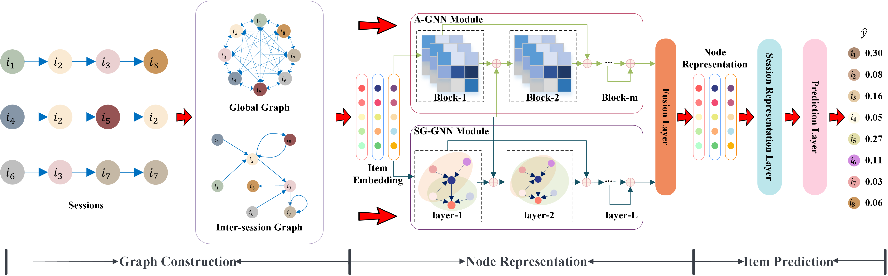

# DGNN-for-Session-based-Recommendation

This is a Pytorch implementation for our WSDM 2023 paper:

> Zihao Li, Xianzhi Wang, Chao Yang, Lina Yao, Julian McAuley, Guandong Xu. 2023. Exploiting Explicit and Implicit Item relationships for Session-based Recommendation. In Proceedings of the Sixteenth ACM International Conference on Web Search and Data Mining (WSDM '23).

Contributors: Zihao Li.

## Overview

We propose to decouple the modeling of explicit dependencies and implicit correlations among items for session-based recommendation.
To this end, we present a dual graph neural network (DGNN), where a GNN with a single gate (SG-GNN) captures the explicit dependencies as reflected by the ordering of items in sessions, and an adaptive GNN (A-GNN) learns implicit correlations between any two items adaptively with a self-learning strategy. Our model works as below,

## Environment Requirement

- Install Python, Pytorch(>=1.8). Our code has been tested running under a Linux desktop (NVIDIA Quadro RTX 6000), Python 3.6.8, Pytorch 1.10.1.  

## Datasets

The preprocessed datasets are included in the repo (e.g. datasets/lastfm/train.txt), where each line contains a session id and item id list (starting from 1) meaning the interactions (sorted by timestamp).

The data pre-processing script (i.e., preprocess_Dig_Yoo) is also included. For example, You can also download the raw Yoochoose-click data from [here](https://www.kaggle.com/datasets/chadgostopp/recsys-challenge-2015?select=yoochoose-clicks.dat).

## Acknowledgement

